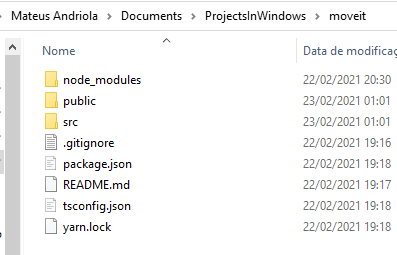
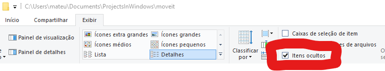
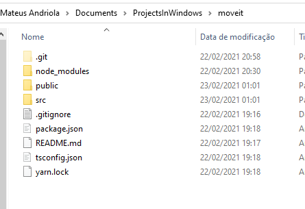
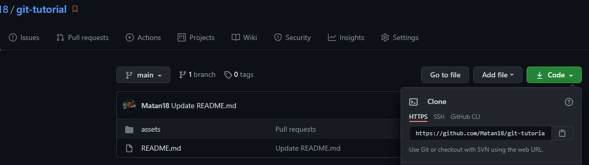

# Introdução

Esse arquivo tem o intúito de explicar o que pode ser uma boa forma de fazer um bom readme para a apresentação do seu projeto, junto com como fazer o publicação do projeto.

## Readme para o campeonato

É muito importante ter um bom readme, para poder fazer a introdução do seu projeto, e principalmente para podermos fazer o programa rodar. Principalmente por esse campeonato não envolver análise tecnicalidades de implementações de código, os jurados não precisam do conhecimento sobre a linguagem para rodar o código, e sem ter esse conhecimento possivelmente não vão saber como fazer o código rodar por conta própria, e essa é a parte mais importante do readme, **explicar como fazer o programa rodar**.

Outro ponto importante, monorepos, sei que algumas equipes estão trabalhando em mais de um programa, exemplo: um programa para backend, e outro para frontend. O ideal seria que todos os programas estejam dentro do mesmo repositório, mas vou dar uma alternativa para optarem, lembrando **tem que estar bem descrito no readme do repositório onde é feito a publicação dos projetos**.

### Monorepo

[APPEntregas (Monorepo)](https://github.com/Matan18/APPEntregas):
Esse projeto é uma aplicação que fiz em NodeJS e React Native, no README principal, eu tenho uma simples apresentação do projeto na introdução, também tem 'como rodar' os dois programas (backend e mobile) no readme principal, mais a frente eu tenho o que é chamado de API Blueprint, ou uma tentativa de API Blueprint (hehe), é basicamente desenhar como a API do servidor se comporta de acordo com cada requisição enviada (Essa informação não vai ser importante para a maioria de vocês);

Eu estou dando esse repositório como exemplo, para que todos certifiquem que quando o jurado for abrir o projeto de vocês, ele vai estar funcionando normalmente, e não haverá nenhum problema quanto ao funcionamento;
Gostaria que se atentassem as informações sobre o banco de dados (isso foi um problema para mim uma vez), onde as instruções estavam incompletas, e o projeto não funcionava corretamente, nesse projeto, eu falo:
* Programas/serviçõs que devem estar instalados/rodando, no caso, me refiro ao node instalado, e ao postgres rodando;
* Postgres deve estar com uma extensão instalada;
* Configuração das conexões ao banco de dados;
* Comandos para instalação de dependências e atualização das tabelas no banco de daos (só quem está trabalhando com banco de dados deve se preocupar com essas coisas);
* Configuração das integrações com a google cloud platform;
* Comandos para iniciar as 2 aplicações;

E é isso que preciso que vocês façam. Para que os jurados não tenham problemas no momento de rodar o projeto de vocês;

### Multi Repo

[Aviário Storage (Multi Repo)](https://github.com/Matan18/aviario_storage):
É um programa para controle de estoque, de certa forma simples, porém tem o que é necessário para dar de exemplo a vocês:
Prestem atenção que dessa vez, eu criei um link onde um repositório leva ao outro e vice/versa, assim quem acessar um repositório, saberá que está ligado ao outro;
Novamente prestem atenção que coloquei as informações necessárias para rodar o projeto, dessa vez, o repositório do backend tem as informações de como rodar o backend, e o repositório do mobile tem as informações necessárias para rodar o app;
As informações são similares, principalmente por que para rodar o backend é muito parecido, espero que tenham entendido o que fazer;

## Publicação do projeto

Se vocês ainda não viram o tutorial principal desse respositório **git-tutorial**, ou não entenderam muito bem o que foi feito, não precisam se preocupar, aqui vai uma forma mais fácil de fazer a publicação do projeto.

* **Disclaimer**: essa forma é mais fácil, para que todos possam entregar o projeto sem nenhuma falta, porém é recomendado que pratiquem muito git, para que essa "gambiarra" não seja necessária;
* **Disclaimer2**: Antes de tudo que estou passando aqui, se desejam utilizar essa forma para publicar o projeto, certifiquem-se que o projeto na sua máquina está atualizado, e que o repostório no meu github está vazio, caso não esteja, exclua todos os arquivos que estão lá (por isso, é um procedimento não recomendado);

Antes de tudo recomendo fortemente que verifiquem e façam na máquina de vocês principalmente as configurações iniciais do git em [Git-Tutorial](https://github.com/Matan18/git-tutorial), isso vai garantir que não haverá nenhum problema na publicação do projeto;

No exemplo que vou dar a vocês estou usando o começo de um projeto da Next Level Week, o projeto é feito em javascript (ReactJS para ser preciso) e tem umas peculiaridades que preciso que entendam;

Ao abrir o projeto como pasta, tenho a seguinte imagem



Mas, se você já iniciou um projeto git, com o comando `git init`, existem arquivos que estão escondidos, e preciso vê-los:
* No linux, isso se resolve apertando ctrl+H; 
* No Windows 10, preciso acessar a aba Exibir e deixar selecionado "Itens ocultos";



E ao fazer isso, tenho a seguinte imagem;



Essa pasta .git que estão vendo são as informações que o git tem sobre esse repositório (todos os commits realizados, remotes adicionados, etc)
Se você está utilizando a ideia de monorepo, e cada programa (programa frontend e programa backend por exemplo) está com a própria pasta .git

Para utilizarmos essa forma mais simples de fazer a publicação do projeto, vamos remover todas as pastas .git de todos os programas, e teremos um projeto sem git após isso;

Eu estou dando um projeto JS principalmente por um detalhe muito importante, a pasta node_modules, no Javascript, todos os projetos com dependências possuem essa pasta, e essa pasta é incrivelmente extensa de arquivos, e não precisamos que esses arquivos (por serem bibliotecas públicas) sejam enviados para o repositório, dependendo da quantidade de arquivos, pode levar longos minutos para mandar tudo pro github, e também para pegar tudo do github;

Para resolver essa situação, eu já falei sobre o .gitignore, e reforço aqui, pois é muito importante.

Acho que já perceberam, mas tem um arquivo na última foto cujo nome é `.gitignore` na minha pasta, ele contém uma lista de arquivos/pastas que a biblioteca do react considera básico para ser ignoradas pelo git, se vocês utilizaram algum framework para iniciar o projeto de vocês, vocês provavelmente já possuem esse arquivo também, então não terão problemas, mas, deem uma olhada se é necessário que algum arquivo/pasta seja ignorado pelo git baseado no framework que estão usando (independente da linguagem);

Após fazer isso, vamos iniciar um novo repositório git, digite o comando `git init`;

Adicione todos arquivos agora no **Stage** (expliquei isso no outro arquivo), com o comando `git add .` (não esqueçam que tem um ponto '.' no final desse comando, fazendo isso, tudo que está dentro dessa pasta será adicionado ao repositório);

Façam o commit o seguinte comando `git commit -m "Commit final"`, no lugar de "Commit final", podem escrever outra coisa.

No repositório que compartilhei com os líderes, cliquem no botão verde escrito "code" e terão o link para o remote, copiem esse link;



Nesse exemplo, o link é `https://github.com/Matan18/git-tutorial.git`, mas certamente cada equipe tem um link diferente. Vocês vão adicionar o link como remote origin, com o seguinte comando;

```
git remote add origin https://github.com/Matan18/git-tutorial.git
```

Por fim, utilize o comando a seguir para mandar os dados da sua máquina, para o meu repositório;

```
git push -u origin main
```

Se ficou alguma dúvida sobre o procedimento, podem entra em contato comigo, tentarei ajudar da melhor forma;
