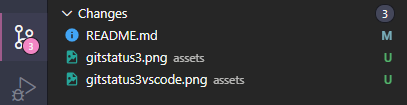

# Tutorial de Git

Esse é um tutorial para aqueles que não sabem nada sobre git, o intuito desse repositório é explicar o básico sobre como manipular arquivos no git e como fazer commit/push/pull requests

## Instalando o git

Antes de tudo, você precisa é ter o git instalado, verifique se ele está instalado com o seguinte comando:

```
git --version
```

Ao fazer isso deve aparecer a versão do git que foi instalada, no meu caso, essa foi a resposta, mas no seu pode ser diferente, o importante é aparecer "git", "version" e um número:

```
git version 2.30.0.windows.2
```

Caso não apareça nada, achei esse link da [hostinger](https://www.hostinger.com.br/tutoriais/tutorial-do-git-basics-introducao) mostrando como instalar nos 3 principais sistemas operacionais (Mac, Windows e Debian/Ubuntu que são 2 versões de Linux), para se certificar que o git está instalado corretamente, reinicie o terminal (feche o powershell/cmd/terminal (no Mac)/bash(do Linux)/... depois abra-o novamente) e rode o comando que mostrei acima.

## Configurações iniciais

Após fazer a instalação, você precisa configurar o seu git, para que cada commit seja identificado, e para isso rode os dois próximos comandos:

```
git config --global user.name "Fulano de Tal"
git config --global user.email fulanodetal@exemplo.br
```

Esses comandos são para a configuração do nome da pessoa que estará fazendo commit e também o e-mail, é usado aspas no primeiro caso para que o git entenda que é um texto só, caso contrário, o que seria registrado no exemplo seria apenas "Fulano" como user.name, e não "Fulano de Tal".
Imagino que vocês perceberam que coloquei "--global" junto com os comandos de configuração de usuário, isso porque você também pode usar a flag "--local", assim, o repositório que você está programando vai entender que você quer usar identificações diferentes pra fazer os commits, nunca usei, mas provavelmente seja usado para representações em empresas. 

Quase pronto, tem mais uma configuração que você deve verificar, por favor digite o comando a seguir:

```
git config --get init.defaultbranch
```

Eu tive a seguinte resposta


### Leve tangente sobre Branchs

Branchs são, basicamente, uma forma do seu código seguir dois caminhos diferentes, por exemplo: 
- O meu programa está rodando com MySQL como banco de dados, mas quero ver se é muito complicado migrar para Postgres, então vou fazer uma branch nova aqui para fazer esse teste.

Criando uma nova branch, o seu código passa a ter dois caminhos, e você pode ir trabalhando nesses caminhos de forma isolada, sem que um caminho afete o outro;
Uma outra analogia para branch são jogos online competitivos, é comum que nos jogos competitivos, existam mais de um servidor (o servidor de testes, o servidor público e o servidor onde acontecem as competições oficiais), e cada servidor está rodando uma versão diferente do jogo, o servidor de testes provavelmente é o mais avançado, e quando os testes são finalizados, esse 'código novo' é mandado para o servidor público, uma vez que o jogo está rodando bem também no servidor público por um tempo, é atualizado o servidor competitivo.

### Configurando Branch principal

Espero que tenham entendido um pouco sobre branchs, mas espero que não tenham preocupações com relação a isso, no começo, isso pode ser um pouco chato de trabalhar, para evitar problemas futuros, vamos voltar e fazer uma alteração nas configurações do git, vocês viram que o meu git está com a branch principal como "master", isso é um problema porque hoje em dia o GitHub quando cria um repositório, usa "main" como branch principal, mas não é difícil de resolver, vamos fazer o mesmo que fizemos com nome e email dos commits, só digitar o seguinte comando:

```
git config --global init.defaultbranch main
```

E vamos conferir se deu tudo certo com o mesmo comando que usamos antes;

```
git config --get init.defaultbranch
```


Pronto, agora podemos finalmente fazer commits/pushs sem nos preocuparmos com os erros mais comuns.

## Iniciando um repositório

Para iniciar um repositório git, basta digitar o comando `git init`, que ele vai criar uma pasta no seu projeto com nome de ".git", e vai começar a se preocupar com as alterações que são feitas no seu projeto.


## Observação

Estou usando o vscode como meu editor desse projeto, e vou mandar fotos de como o 'Source Control' do vscode mostra para nós o que está acontecendo no git, imagino que assim fique mais fácil para que todos entendam o que está acontecendo.

## Changes/Stage & Commit

### Changes

Sempre que o seu código está diferente do seu último commit, o git entende que houve uma alteração, essa alteração pode ser, basicamente: Um arquivo foi criado, um arquivo sofreu uma alteração, um arquivo foi deletado, e essas alterações ficam na lista de Changes do seu repositório, uma forma simples de você verificar essas alterações, é você digitar o comando `git status` no seu terminal preferido;


Nesse projeto, você pode ver que eu tenho um arquivo e uma pasta "Untracked" com o nome de README.md, e a pasta "assets", os arquivos "Untracked são arquivos/pastas que ainda não existiam antes no projeto, e agora existem.

No vscode, ele mostra assim:


Os arquivos *Untracked* ficam com um 'U' do lado, e também mostra o caminho onde encontrar esse arquivos (note que todas as imagens tem uma palavra "assets" do lado, isso indica que essas imagens são encontradas na pasta assets);

### Stage

Um commit é quando você salva uma alteração no seu projeto, quando o projeto como um todo tem uma nova versão do código, mas nem sempre você quer que todas as alterações que você fez sejam salvas imediatamente nessa nova versão, porque algumas funcionalidades novas ainda não estão concluídas, é pra isso que serve o *Stage*.

Vamos adicionar a pasta assets ao Stage para ver o que acontece, para adicionar a pasta, você só precisa digitar `git add assets` vamos ver no terminal e no vscode o que acontece agora, `git status`;


Veja que agora no terminal aparece um novo grupo de arquivos, os arquivos que foram adicionados ao Stage tem o título "Changes to be committed", cada arquivo mostrado tem um texto antes "new file:" indicando que o arquivo foi recém adicionado, e não existia antes no projeto, na parte visual do vscode, agora tem também uma nova lista de "Staged Changes" que indicam a mesma coisa que o terminal (arquivos que estão prontos para ser commitados), também esse arquivos tem a letra 'A' no lado, indicando que estão sendo adicionados ao projeto.
Também veja que o README.md não teve nenhuma alteração, ele continua igual a última foto.

### Commit

Vamos fazer finalmente um *Commit*, digite no terminal:

```
git commit -m "Adicionando fotos da pasta assets"
```

Sempre que fazemos um commit passamos a flag -m e entre áspas uma descrição do que foi feito, essa descrição deve ter menos de 50 caracteres, por isso existem alguns padrões de como escrever essas mensagens, e também de quais arquivos você faz commit, pois você não consegue descrever mais de uma ação, por exemplo: "Criei rota de autenticação/criação de usuário, e rota de listagem de serviços", essa mensagem é muito grande, e dependendo das ações que fez, podem te levar a fazer várias abreviações ao ponto da mensagem não ser compreendida, mas não vou me extender mais ainda nesse assunto hoje, e vamos o que o git nos mostra com o comando `git status` novamente


Veja que os arquivos da pasta assets não estão mais visíveis como alterados, isso porque eles foram commitados, ou seja, foram salvos em uma nova versão do projeto.
Agora só o que aparece é o README.md da forma que tínhamos antes, vamos fazer um commit adicionando ele, para isso, lembrem-se: vamos adicionar o arquivo ao *Stage* com `git add README.md`e depois vamos fazer um commit com `git commit -m 'Adicionando README.md'`, e vamos ver novamente o que o git nos mostra com `git status`;


Absolutamente nada, o nosso projeto está atualizado, com as últimas alterações feitas até agora, porém, percebam que eu ainda não terminei de fazer esse tutorial, e ainda estou adicionando fotos e mensagens no README.md, vamos ver o que aparece com essas alterações novamente `git status`;




Com relação as novas imagens, não tem nenhuma mudança, elas estão marcadas como *Untracked* com o 'U' do lado, porém o nosso README.md está diferente, Ele está num novo campo "Changes not staged for commit", marcado com o 'M' do lado, isso indica que ele foi modificado, tanto é, que no terminal aparece o texto "modified:". 
Vamos dessa vez adicionar todos os arquivos juntos no próximo commit, e existe um comando pra isso:

```
git add .
```

Usar o "." no final indica que você está adicionando tudo que está dentro da nossa pasta principal, uma espiadinha com `git status`novamente:


